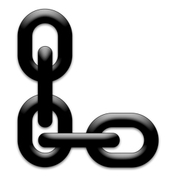

# localhost-converter

Simple desktop app (made with Electron) for converting localhost adresses to shareable adresses in local network.
##Why?
This is a project for me to learn some [Node.js](https://nodejs.org/en/), [Electron](http://electron.atom.io), JavaScript and the basics of handling a GitHub repository. The app might be very unnecessary, but it's somewhat necessary for me.
##How?
The app is a menubar app developed for myself. When using local server environments (with [MAMP](http://www.mamp.info) for example) the adress to the folders of the server is usually structured with the _localhost_ hostname (i.e. _http://localhost:8888/yourfolder_). Working in offices with dynamic IP adresses and being in need of sharing WIP website projects with my colleagues (on the same network), I wanted to create this app so that I easily could replace web adresses containing _localhost_ with my current local IP adress, without having to copy and paste my IP adress from the computers network settings into the _localhost_ adress manually.
####The app works like this
1. Copy localhost adress from web browser.
2. Paste localhost adress into app.
3. Click "Convert".
4. The adress gets copied automatically to clipboard with _localhost_ replaced with your current local IP adress.

##Download
[Download the latest Mac OSX release here!](https://github.com/tobiasger/localhost-converter/releases/)

##Thanks
[shama](https://github.com/shama), [crilleengvall](https://github.com/crilleengvall), [furbel](http://www.sweclockers.com/medlem/furbel), [alling](http://www.sweclockers.com/medlem/alling) & [santi](http://stackoverflow.com/users/2026606/santi) for your help.
